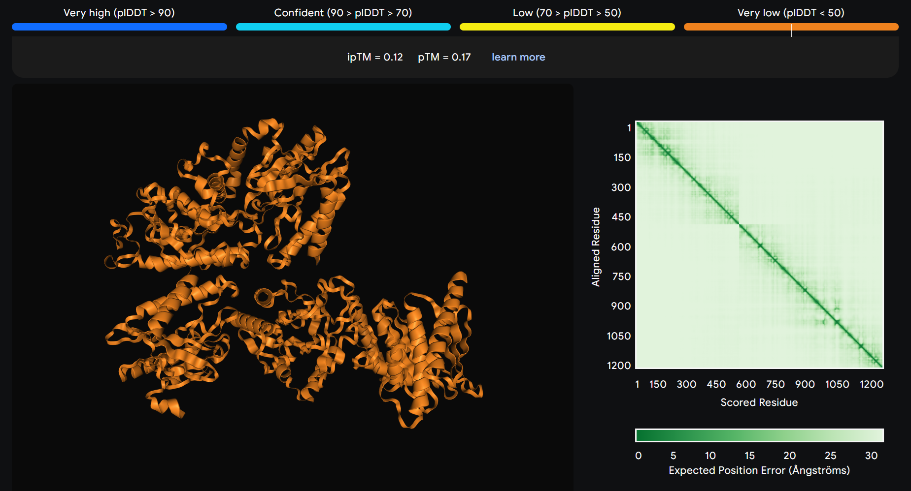

## BBS_Gen - Random Sequence Generator using Blum Blum Shub Algorithm

BBSGen is a C program that generates random DNA, RNA, or protein sequences using the Blum Blum Shub (BBS) algorithm for cryptographically secure random number generation.

*[Blum Blum Shub (BBS)](https://en.wikipedia.org/wiki/Blum_Blum_Shub) algorithm is a cryptographically secure random number generator based on computing squares modulo n = p * q, where p and q are large prime numbers. The algorithm generates a sequence of random bits by extracting the least significant bits from each result. Its main feature is a high degree of randomness and cryptographic strength, making it unpredictable without knowledge of the secret parameters.*

*Unlike the standard rand() generator, BBS provides superior statistical randomness, eliminates correlations, and is well-suited for tasks requiring reliability and realism, especially in biological simulations and bioinformatics analysis.*

## Features

- Generate DNA, RNA, or protein sequences.
- Save sequences to files or output them to the console.
- Configurable sequence length.
- Lightweight and easy to use.

## Usage

### Compilation & Installation

To compile and install the program system-wide:

```bash
make
sudo make install
```

This creates the binary `bbs` in the `bin` directory.

### Running the Program

```bash
bbs <type> <count> [output_prefix]
```

#### Arguments:

- `<type>`: Type of sequence to generate. Options:
  - `dna`: DNA sequence (ACGT).
  - `rna`: RNA sequence (ACGU).
  - `prot`: Protein sequence (ACDEFGHIKLMNPQRSTVWY).
- `<count>`: Length of the sequence to generate.
- `[output_prefix]`: (Optional) Prefix for output file. If omitted, the sequence is printed to the console.

#### Options:

- `--help`: Show usage information.
- `--version`: Show the program version.

1. Generate a DNA sequence of 100 characters and print to the console:
   ```bash
   bbs dna 100
   ```

2. Generate an RNA sequence of 200 characters and save to `output_rna.txt`:
   ```bash
   bbs rna 200 output
   ```

3. Show the help message:
   ```bash
   bbs --help
   ```

To uninstall the program:

```bash
sudo make uninstall
```

To clean the build:

```bash
make clean
```

### By the way, a random protein generated using bbsgen was utilized for testing AlphaFold3. 

*AlphaFold is not a physical simulator and relies on the data it was trained on. As a result, it is limited in its ability to predict structures for random or artificially designed sequences that do not reflect the patterns of natural proteins.*

Result:




